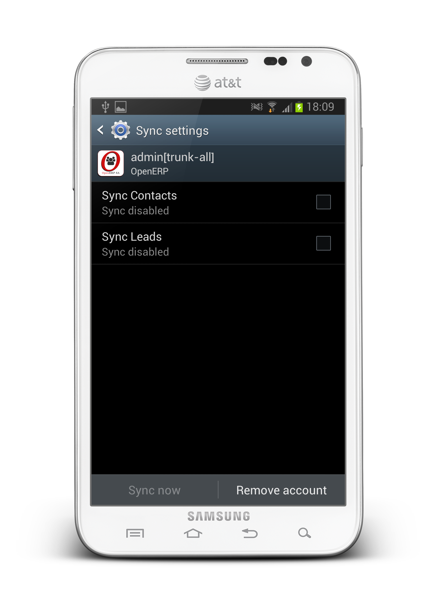
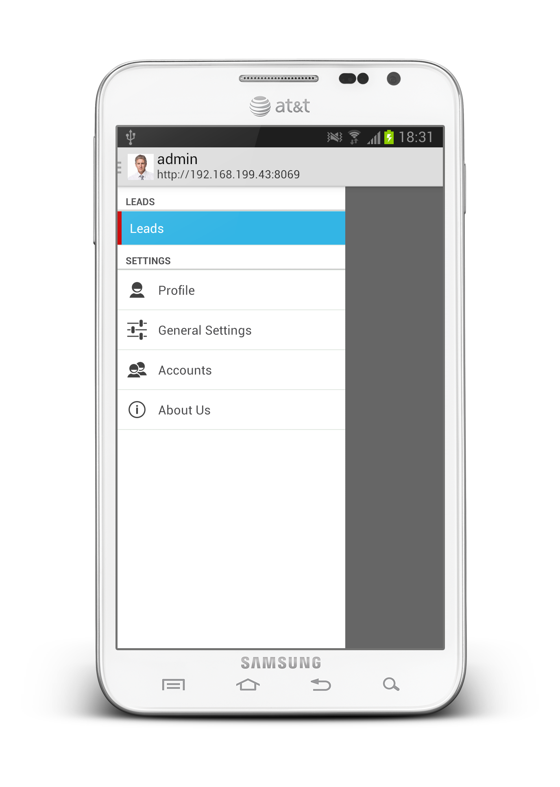

.. OpenERP Mobile documentation master file, created by
   sphinx-quickstart on Tue Mar 25 14:15:37 2014.
   You can adapt this file completely to your liking, but it should at least
   contain the root `toctree` directive.

OpenERP Android Framework Development
=====================================

Building an OpenERP Mobile module
---------------------------------

CRM Lead Module Development
~~~~~~~~~~~~~~~~~~~~~~~~~~~

A very basic module structure will be our starting point:

.. note::
    As a sample, we are going to develop mobile app for **CRM Lead**.

For developing any module you need to add a folder in your ``addons`` directory. So, we are creating a folder for ``crm`` in addons.
Create two files under ``crm``:

* Lead.java *(Android code behind file.)*
* LeadDB.java *(Used for creating local database table and fetching data from sever)*

For creating sync service and module wise sync provider add two folder in crm and add ``LeadService`` file into services and ``LeadProvider`` into providers:

::

    └── crm
        ├── services
        │   └── LeadService.java
        └── providers
            └── lead
                └── LeadProvider.java

See: :doc:`Basic directory structure of OpenERP Android framework: </getting-started/introduction/index>`

**After adding files your directory structure looks like this:**

:: 
    
    └── addons
        └── crm
            ├── LeadDB.java
            ├── Lead.java
            ├── services
            │   └── LeadService.java
            └── providers
                └── lead
                    └── LeadProvider.java

**LeadDB.java**
...............

In this file, you need to inherit ``OEDatabase`` which implements two methods:

* getModelName() - The name of your server model. Here, crm.lead
* getModelColumns() - Returns the list of database table columns

Content of file:

.. code-block:: java

    package com.openerp.addons.crm;

    import java.util.List;

    import android.content.Context;

    import com.openerp.orm.OEColumn;
    import com.openerp.orm.OEDatabase;

    public class LeadDB extends OEDatabase {

	    public LeadDB(Context context) {
		    super(context);
	    }

	    @Override
	    public String getModelName() {
		    return "crm.lead";
	    }

	    @Override
	    public List<OEColumn> getModelColumns() {
		    return null;
	    }

    }

Now we move to add columns in LeadDB.

.. code-block:: java

    package com.openerp.addons.crm;

    import java.util.ArrayList;
    import java.util.List;

    import android.content.Context;

    import com.openerp.base.res.ResPartnerDB;
    import com.openerp.orm.OEColumn;
    import com.openerp.orm.OEDatabase;
    import com.openerp.orm.OEFields;

    public class LeadDB extends OEDatabase {

	    Context mContext = null;
	    public LeadDB(Context context) {
		    super(context);
		    mContext = context;
	    }

	    @Override
	    public String getModelName() {
		    return "crm.lead";
	    }

	    @Override
	    public List<OEColumn> getModelColumns() {
		    List<OEColumn> cols = new ArrayList<OEColumn>();
		
		    cols.add(new OEColumn("name", "name", OEFields.varchar(64)));
		    cols.add(new OEColumn("partner_id", "Customer", OEFields.manyToOne(new ResPartnerDB(mContext))));
		    cols.add(new OEColumn("user_id", "Sales Person", OEFields.manyToOne(new ResUsers(mContext))));
		    cols.add(new OEColumn("categ_ids", "Category", OEFields.manyToMany(new CRMCaseCateg(mContext))));
		    cols.add(new OEColumn("description", "Description", OEFields.text()));
		
		    return cols;
	    }
	    class ResUsers extends OEDatabase {

		    public ResUsers(Context context) {
			    super(context);
		    }

		    @Override
		    public String getModelName() {
			    return "res.users";
		    }

		    @Override
		    public List<OEColumn> getModelColumns() {
			    List<OEColumn> cols = new ArrayList<OEColumn>();
			    cols.add(new OEColumn("name", "name", OEFields.varchar(64)));
			    return cols;
		    }
	    }
	    class CRMCaseCateg extends OEDatabase {

		    public CRMCaseCateg(Context context) {
			    super(context);
		    }

		    @Override
		    public String getModelName() {
			    return "crm.case.categ";
		    }

		    @Override
		    public List<OEColumn> getModelColumns() {
			    List<OEColumn> cols = new ArrayList<OEColumn>();
			    cols.add(new OEColumn("name", "name", OEFields.varchar(64)));
			    return cols;
		    }
	    }
    }

Reference: :doc:`/getting-started/library/fields/index`

Here, we have created two other classes inside LeadDB:

* ResUsers
* CRMCaseCateg

We required relation model to provide column relation. Here, ``ResPartnerDB`` is already in base database models but we required two other models for our relation in columns (many2many and many2one).

Now we are ready with our database structure for CRM Lead.

**Lead.java**
.............

In this file, you need to inherit abstract ``BaseFragment`` which implements two methos:

* databaseHelper() - Returns LeadDB instance.
* drawerMenus() - Returns list of Drawer menu

Reference: :doc:`/getting-started/library/drawer_menus/index`

Content of file:

.. code-block:: java

    package com.openerp.addons.crm;

    import java.util.ArrayList;
    import java.util.List;

    import android.content.Context;
    import android.os.Bundle;
    import android.support.v4.app.Fragment;

    import com.openerp.support.BaseFragment;
    import com.openerp.util.drawer.DrawerItem;

    public class Lead extends BaseFragment {

	    public static final String TAG = Lead.class.getSimpleName();

	    @Override
	    public Object databaseHelper(Context context) {
		    return new LeadDB(context);
	    }

	    @Override
	    public List<DrawerItem> drawerMenus(Context context) {
		    List<DrawerItem> menu = new ArrayList<DrawerItem>();

		    menu.add(new DrawerItem(TAG, "Leads", true));
		    menu.add(new DrawerItem(TAG, "Leads", 0, "#cc0000", object("all")));
		    return menu;
	    }

	    private Fragment object(String value) {
		    Lead lead = new Lead();
		    Bundle bundle = new Bundle();
		    bundle.putString("lead_value", value);
		    lead.setArguments(bundle);
		    return lead;

	    }
    }

**LeadService.java**
.......................

This file used to fetch data from server when user start sync service. It inherit ``OEService`` class which implement two methods:

* getService() - returns self object i.e., ``this``
* performSync() - called when user start sync.

Content of file:

.. code-block:: java

    package com.openerp.addons.crm.services;

    import android.accounts.Account;
    import android.app.Service;
    import android.content.ContentProviderClient;
    import android.content.Context;
    import android.content.SyncResult;
    import android.os.Bundle;

    import com.openerp.support.service.OEService;

    public class LeadService extends OEService {

	    @Override
	    public Service getService() {
		    return this;
	    }

	    @Override
	    public void performSync(Context context, Account account, Bundle extras,
			    String authority, ContentProviderClient provider,
			    SyncResult syncResult) {

	    }

    }

Here, ``performSync()`` method will called when user start sync. We just need to call our database model and start sync for our model.

.. code-block:: diff

    public class LeadService extends OEService {

	    @Override
	    public Service getService() {
		    return this;
	    }

	    @Override
	    public void performSync(Context context, Account account, Bundle extras,
			    String authority, ContentProviderClient provider,
			    SyncResult syncResult) {
    +   	    LeadDB lead = new LeadDB(context);
    +   	    OEHelper oe = lead.getOEInstance();
    +   	    if (oe != null) {
    +   		    if (oe.syncWithServer()) {
    +   			    // TODO: Sync finished
    +   		    }
    +   	    }
	    }

    }

Now, add service entry into ``AndroidManifest.xml`` file:
Add service tag under ``<application>`` tag

.. code-block:: xml

    <service
        android:name="com.openerp.addons.crm.services.LeadService"
        android:exported="true" >
    </service>

We are ready with our service but; we need service provider and its syn-adapter xml file to display it under Android Accounts.

**LeadProvider.java**
........................

This file provide authority and sync adapter to our sync service. It inherit ``OEContentProvider`` which implement two methods:

* authority() - returns provider authority string
* contentUri() - returns privider content uri string

Content of file:

.. code-block:: java

    package com.openerp.addons.crm.providers.lead;

    import com.openerp.support.provider.OEContentProvider;

    public class LeadProvider extends OEContentProvider {
        public static String CONTENTURI = "com.openerp.addons.crm.providers.lead.LeadProvider";

        public static String AUTHORITY = "com.openerp.addons.crm.providers.lead";

        @Override
        public String authority() {
	        return AUTHORITY;
        }

        @Override
        public String contentUri() {
	        return CONTENTURI;
        }

    }

Content Provider is ready now, but we must link this provider with sync-adapter xml file. 

Create new ``sync_crm_adapter.xml`` file under ``/res/xml/``

.. code-block:: xml

    <sync-adapter xmlns:android="http://schemas.android.com/apk/res/android"
        android:accountType="com.openerp.auth"
        android:contentAuthority="com.openerp.addons.crm.providers.lead"
        android:supportsUploading="true"
        android:userVisible="true" />

Here, we uses ``com.openerp.auth`` type for creating our custom OpenERP account under Android Accounts.

Now, we have to add this providers entry into ``AndroidManifest.xml`` file using ``<provider>`` tag.

.. code-block:: diff

    +    <provider
    +        android:name="com.openerp.addons.crm.providers.lead.LeadProvider"
    +        android:authorities="com.openerp.addons.crm.providers.lead"
    +        android:enabled="true"
    +        android:exported="true"
    +        android:label="Leads"
    +        android:syncable="true" />

    <service
        android:name="com.openerp.addons.crm.services.LeadService"
        android:exported="true" >
    +        <intent-filter>
    +            <action android:name="android.content.SyncAdapter" />
    +        </intent-filter>

    +        <meta-data
    +            android:name="android.content.SyncAdapter"
    +            android:resource="@xml/sync_crm_adapter" />
    </service>
    
To test that sync service is added under Android account run your application and create account. You can find your sync service provider as below screenshot:

    
Now, We are ready with our core setup. Registering our module in ``ModuleConfig.java`` under ``com.openerp.config`` package.

.. code-block:: java

    package com.openerp.config;

    import com.openerp.addons.crm.Lead;
    import com.openerp.support.Module;
    import com.openerp.support.ModulesConfigHelper;

    public class ModulesConfig extends ModulesConfigHelper {

	    public ModulesConfig() {
		    add(new Module("module_crm", "CRM Lead", new Lead()), true);
	    }
    }

Now, First of all uninstall app from your device or emulator because it had created some base database tables. After unstalling run your application. It will show you your menu for CRM Lead as below screenshot: 

Now, we create one ``crm_lead_layout.xml`` file for viewing all leads. 
Create file under ``res/layout/``

.. code-block:: xml

    <LinearLayout xmlns:android="http://schemas.android.com/apk/res/android"
        android:layout_width="match_parent"
        android:layout_height="match_parent"
        android:orientation="vertical" >

        <ListView
            android:id="@+id/crmLeadListView"
            android:layout_width="match_parent"
            android:layout_height="match_parent" >
        </ListView>

    </LinearLayout>
    
Also create one ``crm_lead_custom_row.xml`` that we will use for our ``ListView`` custom layout.

.. code-block:: xml

    <LinearLayout xmlns:android="http://schemas.android.com/apk/res/android"
        android:layout_width="match_parent"
        android:layout_height="match_parent"
        android:orientation="horizontal"
        android:padding="5dp" >

        <ImageView
            android:id="@+id/imgCustomerPic"
            android:layout_width="42dp"
            android:layout_height="42dp"
            android:layout_gravity="center_vertical"
            android:src="@drawable/ic_launcher" />

        <LinearLayout
            android:layout_width="0dp"
            android:layout_height="match_parent"
            android:layout_weight="1"
            android:orientation="vertical"
            android:padding="5dp" >

            <TextView
                android:id="@+id/txvLeadName"
                android:layout_width="match_parent"
                android:layout_height="wrap_content"
                android:text="Lead Name"
                android:textAppearance="?android:attr/textAppearanceMedium" />

            <TextView
                android:id="@+id/txvLeadSalesPerson"
                android:layout_width="match_parent"
                android:layout_height="wrap_content"
                android:text="Sales Person Name"
                android:textAppearance="?android:attr/textAppearanceSmall" />

            <TextView
                android:id="@+id/txvLeadDescription"
                android:layout_width="match_parent"
                android:layout_height="wrap_content"
                android:ellipsize="end"
                android:singleLine="true"
                android:text="Lead Description"
                android:textAppearance="?android:attr/textAppearanceSmall" />
        </LinearLayout>

    </LinearLayout>
    
We have created our Layout files. Now open ``Lead.java`` file and override ``onCreateView()`` method.

.. code-block:: diff

    public class Lead extends BaseFragment {

	    public static final String TAG = Lead.class.getSimpleName();

    +	    View mView = null;
    +       ListView mListview = null;
    +       OEListAdapter mListAdapter = null;
    +       List<Object> mLeadItems = new ArrayList<Object>();    

    +	    @Override
    +	    public View onCreateView(LayoutInflater inflater, ViewGroup container,
    +			    Bundle savedInstanceState) {
    +		    mView = inflater.inflate(R.layout.crm_layout, container, false);
    +		    return mView;
    +	    }
	    
        . . . . .
        . . . . . 

Create ``init()`` method to for initiate objects.

.. code-block:: diff

    public class Lead extends BaseFragment {

	    public static final String TAG = Lead.class.getSimpleName();

	    View mView = null;
	    ListView mListview = null;
	    OEListAdapter mListAdapter = null;
	    List<Object> mLeadItems = new ArrayList<Object>();
    +	    LeadLoader mLeadLoader = null;

	    @Override
	    public View onCreateView(LayoutInflater inflater, ViewGroup container,
			    Bundle savedInstanceState) {
		    scope = new AppScope(getActivity());
		    mView = inflater.inflate(R.layout.crm_lead_layout, container, false);
    +		    init();
		    return mView;
	    }

    +	    private void init() {
    +		    mListview = (ListView) mView.findViewById(R.id.crmLeadListView);
    +		    mListAdapter = new OEListAdapter(getActivity(),
    +				    R.layout.crm_lead_custom_row, mLeadItems) {
    +			    @Override
    +			    public View getView(int position, View convertView, ViewGroup parent) {
    +				    View view = convertView;
    +				    if (view == null)
    +					    view = getActivity().getLayoutInflater().inflate(getResource(),
    +							    parent, false);
    +				    return view;
    +			    }
    +		    };
    +		    mListview.setAdapter(mListAdapter);
    +               mLeadLoader = new LeadLoader();
    +               mLeadLoader.execute();
    +	    }

    +	    private void checkStatus() {
    +		    if (db().isEmptyTable()) {
    +			    scope.main().requestSync(LeadProvider.AUTHORITY);
    +		    }
    +	    }

    +	    class LeadLoader extends AsyncTask<Void, Void, Void> {
    +
    +		    @Override
    +		    protected Void doInBackground(Void... params) {
    +                       mLeadItems.clear();
    +			    LeadDB db = new LeadDB(getActivity());
    +			    mLeadItems.addAll(db.select());
    +			    return null;
    +		    }
    +
    +		    @Override
    +		    protected void onPostExecute(Void result) {
    +			    mListAdapter.notifiyDataChange(mLeadItems);
    +			    checkStatus();
    +		    }
    +	    }

Here, we have created **asynchronous task** ``LeadLoader`` for loading row from data table in background process. After finishing data loading we have checked for record availability. If we got empty table than system will start sync as written in ``checkStatus()`` method.

Now, we have to fill each data in our custom row of ListView as below code:

.. code-block:: diff

    private void init() {
        mListview = (ListView) mView.findViewById(R.id.crmLeadListView);
        mListAdapter = new OEListAdapter(getActivity(),
		        R.layout.crm_lead_custom_row, mLeadItems) {
	        @Override
	        public View getView(int position, View convertView, ViewGroup parent) {
		        View view = convertView;
		        if (view == null)
			        view = getActivity().getLayoutInflater().inflate(getResource(),
					        parent, false);
		
    +                OEDataRow row = (OEDataRow) mLeadItems.get(position);

    +                ImageView imgCustomerPic = (ImageView) view.findViewById(R.id.imgCustomerPic);
    +                Bitmap bitmap = null;
    +                OEDataRow partner = row.getM2ORecord("partner_id").browse();
    +                if (partner != null) {
    +	                String base64Image = partner.getString("image_small");
    +	                bitmap = Base64Helper.getBitmapImage(getActivity(), base64Image);
    +                }
    +                imgCustomerPic.setImageBitmap(bitmap);

    +                TextView txvName, txvSalesPerson, txvDescription;
    +                txvName = (TextView) view.findViewById(R.id.txvLeadName);
    +                txvSalesPerson = (TextView) view.findViewById(R.id.txvLeadSalesPerson);
    +                txvDescription = (TextView) view.findViewById(R.id.txvLeadDescription);

    +                txvName.setText(row.getString("name"));
    +                OEDataRow user = row.getM2ORecord("user_id").browse();
    +                String salesPerson = "";
    +                if (user != null)
    +	                salesPerson = user.getString("name");
    +                txvSalesPerson.setText(salesPerson);

    +                if(salesPerson.equals("false"))
    +	                txvSalesPerson.setVisibility(View.GONE);

    +                txvDescription.setText(row.getString("description"));
    +                if(row.getString("description").equals("false"))
    +	                txvDescription.setVisibility(View.GONE);
		        return view;
	        }
        };
        mListview.setAdapter(mListAdapter);
    }
    
Now we are ready with our app. But when there are no any data in data table app will start sync, on sync finish we have to reload listview.
For that we just register ``SyncFinishReceiver`` receiver in your fragment.

.. code-block:: java

    @Override
    public void onResume() {
	    super.onResume();
	    getActivity().registerReceiver(mSyncFinish,
			    new IntentFilter(SyncFinishReceiver.SYNC_FINISH));
    }

    @Override
    public void onPause() {
	    super.onPause();
	    getActivity().unregisterReceiver(mSyncFinish);
    }

    SyncFinishReceiver mSyncFinish = new SyncFinishReceiver() {
	    public void onReceive(Context context, android.content.Intent intent) {
		    mLeadLoader = new LeadLoader();
		    mLeadLoader.execute();
	    };
    };

Broadcast Syncfinish intent from your LeadService when sync finished:

.. code-block:: diff

    public class LeadService extends OEService {

	    @Override
	    public Service getService() {
		    return this;
	    }

	    @Override
	    public void performSync(Context context, Account account, Bundle extras,
			    String authority, ContentProviderClient provider,
			    SyncResult syncResult) {
		    LeadDB lead = new LeadDB(context);
		    OEHelper oe = lead.getOEInstance();
		    if (oe != null) {
			    if (oe.syncWithServer()) {
    -   			    // TODO: Sync finished			    
    +				    Intent intent = new Intent(SyncFinishReceiver.SYNC_FINISH);
    +				    sendBroadcast(intent);
			    }
		    }
	    }

    }

    
Now, Run your application. It will first sync lead from server and when sync finish. Receiver got call and your listview will be reloaded.

.. image:: images/final_output_framed.png
    :width: 400px
    
Download Demo application source
~~~~~~~~~~~~~~~~~~~~~~~~~~~~~~~~

:download:`file/openerp-mobile-crm.zip`

