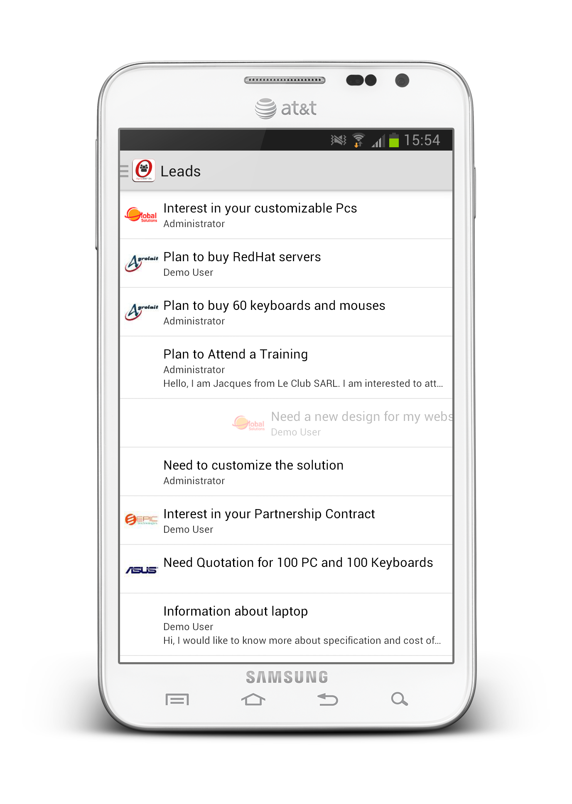

.. OpenERP Mobile documentation master file, created by
   sphinx-quickstart on Tue Mar 25 14:15:37 2014.
   You can adapt this file completely to your liking, but it should at least
   contain the root `toctree` directive.

OETouchListener
===============

OETouchListener class used for providing pulling or swiping features to your listview.

PullListener
------------

Called when pulled down listview, gridview or scrollview.

Syntax:

.. code-block:: java

    class Demo extends BaseFragment implements OnPullListener {
        
        OETouchListener mTouchListener = null;
        ListView mListView = null;
        
        @Override
        public View onCreateView(LayoutInflater inflater, ViewGroup container,
		        Bundle savedInstanceState) {
            mView = inflater.inflate(R.layout.demo_layout, container, false);

            mListView = (ListView) mView.findViewById(R.id.myListView);

            scope = new AppScope(getActivity());	    
            mTouchListener = scope.main().getTouchAttacher();

            mTouchListener.setPullableView(mListview, this);

            return mView;
        }
        
        @Override
        public void onPullStarted(View view) {
            // Task to-do 	
        }
    }

.. image:: images/pull_sync.png
    :width: 400px

SwipeListener
-------------

Called when you swipe listview or gridview row left to right or right to left.

.. code-block:: java

    class Demo extends BaseFragment implements SwipeCallbacks {
        
        OETouchListener mTouchListener = null;
        ListView mListView = null;
        
        @Override
        public View onCreateView(LayoutInflater inflater, ViewGroup container,
		        Bundle savedInstanceState) {
            mView = inflater.inflate(R.layout.demo_layout, container, false);

            mListView = (ListView) mView.findViewById(R.id.myListView);

            scope = new AppScope(getActivity());	    
            mTouchListener = scope.main().getTouchAttacher();

            mTouchListener.setSwipeableView(mListview, this);
            mListview.setOnScrollListener(mTouchListener.makeScrollListener());

            return mView;
        }
        
        @Override
        public boolean canSwipe(int position) {
            // return true if you want to allow position to swipe
            return true;
        }

        @Override
        public void onSwipe(View view, int[] ids) {

        }
    }

