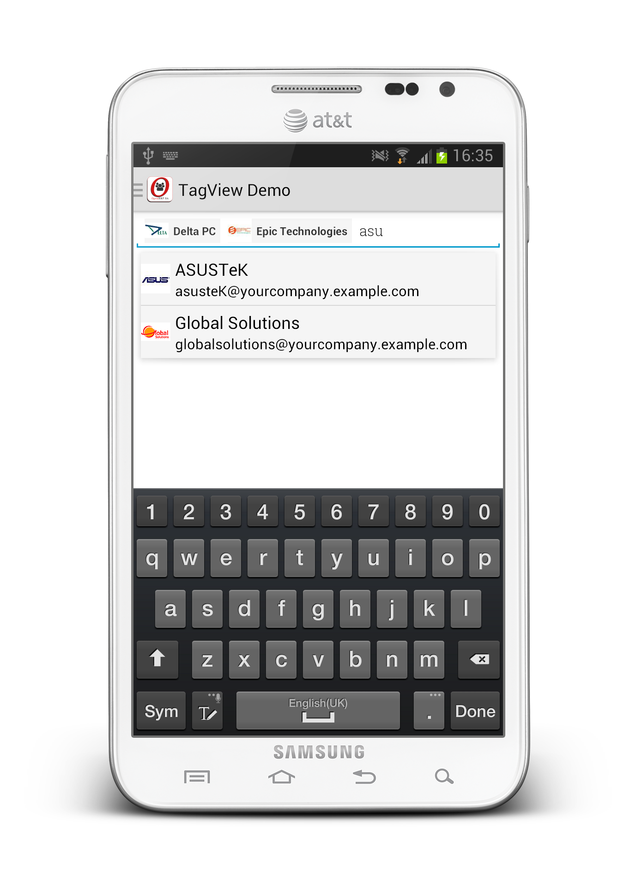

.. OpenERP Mobile documentation master file, created by
   sphinx-quickstart on Tue Mar 25 14:15:37 2014.
   You can adapt this file completely to your liking, but it should at least
   contain the root `toctree` directive.

TagsView
========

TagsViewDemo.java
.................

TagsView provide AutoComplete Tags with custom UI.

.. code-block:: java

    public class TagsViewDemo extends BaseFragment implements TokenListener {

	    View mView = null;
	    TagsView mTagsView = null;
	    OEListAdapter mAdapter = null;
	    List<Object> mPartners = new ArrayList<Object>();

	    @Override
	    public View onCreateView(LayoutInflater inflater, ViewGroup container,
			    Bundle savedInstanceState) {
		    mView = inflater.inflate(R.layout.tags_view_layout, container, false);
		    init();
		    return mView;
	    }

	    private void init() {

		    mPartners.clear();
		    mPartners.addAll(db().select());
		    mTagsView = (TagsView) mView.findViewById(R.id.tagsView);
		    
		    // generate tags (small tag)
		    mTagsView.setCustomTagView(new CustomTagViewListener() {

			    @Override
			    public View getViewForTags(LayoutInflater layoutInflater,
					    Object object, ViewGroup tagsViewGroup) {
				    View view = layoutInflater.inflate(
						    R.layout.tags_view_custom_tag_layout, tagsViewGroup,
						    false);
				    initView(object, view);

				    return view;
			    }
		    });

		    mAdapter = new OEListAdapter(getActivity(),
				    R.layout.tags_view_custom_layout, mPartners) {
			    @Override
			    public View getView(int position, View convertView, ViewGroup parent) {
				    View view = convertView;
				    if (view == null)
					    view = getActivity().getLayoutInflater().inflate(
							    getResource(), parent, false);
				    initView(mPartners.get(position), view);
				    return view;
			    }
		    };
		    mTagsView.setTokenListener(this);
		    mTagsView.setAdapter(mAdapter);
	    }

	    private void initView(Object object, View view) {
		    OEDataRow row = (OEDataRow) object;
		    ImageView imgPic = (ImageView) view.findViewById(R.id.tagImage);
		    TextView txvName, txvEmail;
		    txvName = (TextView) view.findViewById(R.id.tagName);
		    txvEmail = (TextView) view.findViewById(R.id.tagEmail);

		    imgPic.setImageBitmap(Base64Helper.getBitmapImage(getActivity(),
				    row.getString("image_small")));
		    txvName.setText(row.getString("name"));
		    txvEmail.setText(row.getString("email"));
	    }

	    @Override
	    public Object databaseHelper(Context context) {
		    return new ResPartnerDB(context);
	    }

	    @Override
	    public List<DrawerItem> drawerMenus(Context context) {
		    List<DrawerItem> menu = new ArrayList<DrawerItem>();

		    menu.add(new DrawerItem("key", "TagView demo", true));
		    menu.add(new DrawerItem("key", "TagView Demo", 0, "#0099cc",
				    object("all")));
		    return menu;
	    }

	    private Fragment object(String value) {
		    TagsViewDemo lead = new TagsViewDemo();
		    Bundle bundle = new Bundle();
		    bundle.putString("value", value);
		    lead.setArguments(bundle);
		    return lead;

	    }

	    @Override
	    public void onTokenAdded(Object token, View view) {
		    OEDataRow row = (OEDataRow) token;
		    Toast.makeText(getActivity(), row.getString("name") + " added.",
				    Toast.LENGTH_LONG).show();
	    }

	    @Override
	    public void onTokenSelected(Object token, View view) {

	    }

	    @Override
	    public void onTokenRemoved(Object token) {
		    OEDataRow row = (OEDataRow) token;
		    Toast.makeText(getActivity(), row.getString("name") + " removed.",
				    Toast.LENGTH_LONG).show();
	    }

    }

tags_view_layout.xml
....................

.. code-block:: xml

    <LinearLayout xmlns:android="http://schemas.android.com/apk/res/android"
        android:layout_width="match_parent"
        android:layout_height="match_parent"
        android:orientation="vertical"
        android:padding="20dp" >

        <com.openerp.util.tags.TagsView
            android:id="@+id/tagsView"
            android:layout_width="match_parent"
            android:layout_height="wrap_content" />

    </LinearLayout>

tags_view_custom_tag_layout.xml
...............................

.. code-block:: xml

    <LinearLayout xmlns:android="http://schemas.android.com/apk/res/android"
        android:layout_width="match_parent"
        android:layout_height="match_parent"
        android:background="#f5f5f5"
        android:orientation="horizontal" >

        <ImageView
            android:id="@+id/tagImage"
            android:layout_width="26dp"
            android:layout_height="26dp"
            android:layout_gravity="center_vertical"
            android:src="@drawable/ic_launcher" />

        <LinearLayout
            android:layout_width="match_parent"
            android:layout_height="wrap_content"
            android:orientation="vertical"
            android:padding="5dp" >

            <TextView
                android:id="@+id/tagName"
                android:layout_width="match_parent"
                android:layout_height="wrap_content"
                android:text="Name"
                android:textAppearance="?android:attr/textAppearanceSmall"
                android:textStyle="bold" />

            <TextView
                android:id="@+id/tagEmail"
                android:layout_width="match_parent"
                android:layout_height="wrap_content"
                android:text="Email"
                android:textAppearance="?android:attr/textAppearanceSmall"
                android:visibility="gone" />
        </LinearLayout>

    </LinearLayout>

Download Demo application source
~~~~~~~~~~~~~~~~~~~~~~~~~~~~~~~~

:download:`file/openerp-mobile-crm.zip`
