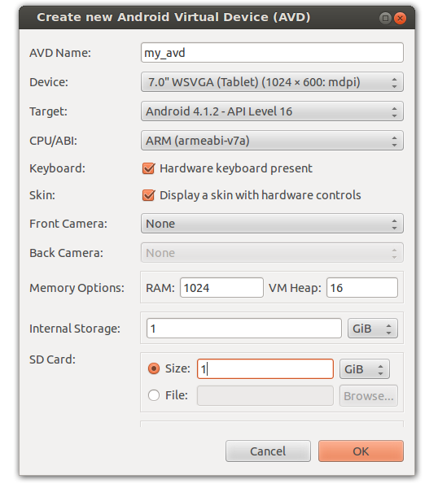
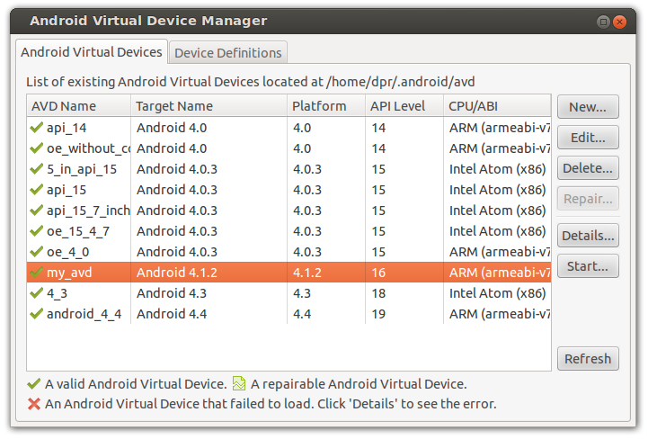

.. OpenERP Mobile documentation master file, created by
   sphinx-quickstart on Tue Mar 25 14:15:37 2014.
   You can adapt this file completely to your liking, but it should at least
   contain the root `toctree` directive.

Configure virtual device
==================================

To test your application android SDK provide virtual devices with different configuration and Resolutions. Here are steps to create your own virtual device.

**Step 1:**

Start your Virtual device manager from toolbar OR  Start your Virtual device manager from menu : Window > Android Virtual Device Manager
Below screen will appear with created virtual devices list (if any) and Device Definitions

.. image:: images/step1.png

**Step 2:**

Click on new button to create your new AVD (Android Virtual Device). Below dialog will appear when you click on new button.

You can see your AVD in the list after successfull creation.

**Step 3:**

To launch (start) your AVD select your avd and click on Start button. Below screen will appear, if you want to resize your AVD screen than tick Scale display to real size and provide Monitor dpi as per your requirement.

.. image:: images/step3.png

You can also clean all your old data which are used at last run by checking second option Wipe user data

.. image:: images/step3_1.png

**Step 4:**

Click on Launch button to start your AVD

.. image:: images/step4.png
